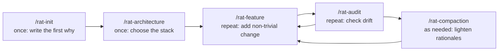

# Rat-Coding

> **A tiny rationale file as code, driving your AI agent.**

Rat-Coding is a lightweight development practice for working with AI coding agents. You start the way you'd start any AI session — _"hey, I want to build something like this…"_ — but every non-trivial decision gets one or two paragraphs in a single small file: **`doc/rationales.md`**. The AI loads that file every session and treats it as code: the runtime that conditions how it pairs with you on _your_ project.

The name says it: **Rat** is for **Rationale**. And rats are small — the rationale file is too. That is the whole trick:

- 🐀 **Small enough to fit in the context window.** The AI loads it _every_ session and actually reasons over it, instead of guessing or contradicting yesterday's decisions.
- 💬 **Light enough to start with a conversation.** No upfront spec, no design tree, no template gauntlet. You can begin Rat-Coding the same way you begin Vibe Coding: by talking.

## Why?

AI agents are wonderful at velocity. They are terrible at memory. After a few iterative sessions, the _what_ is in the code, but the _why_ has evaporated:

- Why is this structured this way? — _Nobody remembers._
- Why didn't we build feature X? — _Nobody remembers._
- The AI silently contradicts a past decision. — _Nobody notices._

"Vibe Coding" — riding the AI's momentum on intuition — is fast and frictionless, but accelerates this drift. Spec-driven approaches go the other way and write everything down upfront — a discipline that brings real rigor and works well in the right context, but that carries a setup cost many projects don't need from day one.

Rat-Coding takes a different path: **start by talking, write down only the _why_, and let the AI carry the rest.**

## How it works

Rat-Coding rests on a small project-visible runtime plus two project truth files:

|                            | What                                                                                             | Where            |
| -------------------------- | ------------------------------------------------------------------------------------------------ | ---------------- |
| **`AGENTS.md`**            | The always-on rules that make the agent read and act on the project's rationales. _Mandatory._   | repo root        |
| **Rat-Coding skills**      | The workflows (`/rat-init`, `/rat-feature`, `/rat-audit`, ...), installed by a standard skill manager. _Mandatory._ | repo        |
| 📰 **`README.md`**         | The project's press release. The idealized image of the product, written for users. _Mandatory._ | repo root        |
| 🐀 **`doc/rationales.md`** | The durable "why". Every non-trivial design decision and the alternatives rejected. _Mandatory._ | repo             |
| 🗺️ **`doc/design.md`**     | A map of the implementation, for contributors who want one. _Optional._                          | repo             |

That's it. **No spec, no ticket archaeology, no parallel design tree.** The source code is part of the Single Source of Truth — modern AI can explain code on demand, so the docs only need to carry what code _can't_ encode: the reasoning.

## Quick start

### Bootstrap Rat-Coding

Rat-Coding is installed per project. The intended bootstrap path is to install only the `/rat-init` skill with your agent's standard skill manager, then run `/rat-init` in the repository. `/rat-init` installs or merges the always-on `AGENTS.md` rules from its bundled asset, checks whether the rest of the Rat-Coding skills are installed, offers to install them with the detected skill manager when missing, reloads the rules for the current session, then helps create `README.md` and `doc/rationales.md` through dialogue.

Bootstrap has two steps:

1. Install only the `/rat-init` skill from this repository. Use a standard Agent Skills installer, for example:

  ```sh
  gh skill install Maki-Daisuke/rat-coding rat-init
  npx skills add Maki-Daisuke/rat-coding rat-init
  apm install Maki-Daisuke/rat-coding --skill rat-init
  ```

2. Open the target project directory and run `/rat-init`.

After `/rat-init` runs, the rules will be active for that workspace and the rest of the slash commands (`/rat-feature`, `/rat-audit`, …) should be available through the same skill manager. Existing different files are not overwritten unless the user explicitly approves replacement. If the target project already has `AGENTS.md`, `/rat-init` asks whether to merge Rat-Coding's rules into it; approved merges preserve the existing file and add Rat-Coding in a marked managed block. There is no Rat-Coding shell installer; skill installation belongs to `gh skill`, `npx skills`, APM, or another compatible skill manager.

### Bootstrap a project

Rat-Coding is a small loop, not a big process. Two skills usually run once near the start of a project, then the product-growth and rationale-health skills repeat as the product grows:



After installing the `/rat-init` skill, open Copilot Chat in an empty (or existing) repo and run:

```
/rat-init
```

The skill will:

1. Install or merge the project-visible `AGENTS.md` rules from its bundled asset.
2. Check `.agents/` and `.claude/` for the rest of the Rat-Coding skills, then offer to install missing skills with the detected skill manager.
3. Reload `AGENTS.md` for the current session.
4. Hold a short dialogue about what you want to build, why it matters now, what already exists, and what is deliberately out of scope.
5. Scaffold `README.md` and `doc/rationales.md` (seeded with its first entry: _"Why this project exists"_), and offer `doc/design.md` by default as an optional implementation map.
6. Hand the keyboard back to you with the first durable _why_ on the record.

Then, when you are ready to choose architecture/frameworks and initialize the codebase with standard ecosystem tooling:

```
/rat-architecture
```

That skill investigates similar existing products, proposes options with explicit trade-offs, incorporates your preferences, and initializes the project using de facto standard procedures after explicit approval.

After that, use `/rat-feature` whenever you add a non-trivial behavior, public surface, dependency, or architectural change. Use `/rat-audit` whenever you want to check whether the README, rationales, optional design map, tests, and implementation still agree. If the rationale file grows beyond its context budget, use `/rat-compaction` to keep `doc/rationales.md` as a small always-loaded runtime kernel while moving detailed history into supporting rationale files. Between those named workflows, `AGENTS.md` stays active as the always-on behavior: read `doc/rationales.md`, ask why before non-trivial choices, surface contradictions, and keep docs and code from drifting apart.

### Day-to-day

You can still start by talking to your agent normally:

> _"I want to add a CLI for converting CSV to JSON."_

If that turns out to be a non-trivial change, Rat-Coding should route the conversation through `/rat-feature`: clarify why, check alternatives, record the rationale, then implement. You can also invoke `/rat-feature` directly when you already know the change is non-trivial.

For small fixes, typos, formatting, and behavior-preserving cleanup, no feature workflow is needed. `AGENTS.md` remains active in the background: it reminds the agent to read `doc/rationales.md`, surface conflicts, and keep docs and code from drifting apart.

When you suspect drift, run `/rat-audit` and the agent will compare recent code against the rationales and flag anything inconsistent. When you suspect the rationale record is getting too large for cheap always-on loading, run `/rat-compaction` and the agent will preserve the durable why while compacting the main file into a smaller routing kernel.

## Philosophy

A few principles that drive every choice in this repo. The full reasoning lives in [`doc/rationales.md`](./doc/rationales.md).

- **Rationale is part of the product, and the AI's runtime.** `doc/rationales.md` carries the durable why so each session can continue from yesterday's reasoning.
- **Not building matters when building gets cheap.** AI makes code easy to add; Rat-Coding records rejected alternatives and non-goals so complexity is not added by default.
- **Truth grows through contact with reality.** Code, tests, README, and rationales each carry part of the truth; the product sharpens through dialogue with what actually runs.
- **Methodology should serve people, not rule them.** The agent surfaces contradictions and risks, then asks. It does not turn process into a creed.

> Rat-Coding was made for man, not man for Rat-Coding.

## Status

Early. The rationales are written, the README you are reading exists, and the rest is on its way — built one "why?" at a time. Watch this space.

## License

[MIT License](./LICENSE).

## Author

Daisuke (yanother) Maki.
